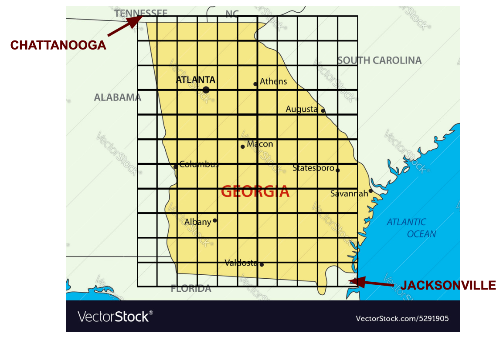

# YourNextGeocache: A recommender app for avid geocachers

### Why is this needed?

| view 0 | view 1 | view 2 |
|---|---|---|
||||
(images are from geocaching.com)

### Problem Statement: How should you pick your next cache?

My objective is to create a "content-based" recommender system for geocaches. For a geocacher using my app, they will get results something like: "If you liked GC47X42 'That Really Big Tree', then you'll probably enjoy ...."

This is designed for anyone who enjoys geocaching! My father & step-mom, my husband and myself are all geocachers. There are MILLIONS of caches world-wide. When I log in, I see 228 caches within 3.5 miles of my house. How should I decide where to go? Existing filters on geocaching.com are inadequate, and new caches are showing up all the time. This recommender app aims to solve this problem. If successful (and with full access to ALL the global data, far beyond the current scope of this project), geocaching.com could implement this app into their platform, to improve the experience for everyone within the geocaching community.

__Success is a bit difficult to define in a recommender system, since they do not have an inherent target variable that is known for some training set.__ 

* In this case, I do have a feature "FavPoints" which is related (equal?) to the number of geocachers who have marked a given cache as a "favorite". So I could do a supervised learning stage of this project, prediciting "FavPoints", and use that to help me evaluate my unsupervised recommender model.

* For KMeans, I can use silhouette score and inertia to get some measure of how good the clustering is.

* For DBSCAN, I can use silhouette score, inertia, and also the percentage of caches that get labeled as noise rather than being clustered.

* For recommending based on cosine similarity, I would want to see whether or not I can get some that are clearly a lot more similar (cs close to 1) and others clearly different (cs close to -1), vs. all having cosine similarity close to 0. I would also hope that the pairs/groups of caches with cosine similarity closest to 1 would tend to be in the same clusters from KMeans and/or DBSCAN -- sort of using the different methods to validate one another.

### Plan (to-do) :

1. Acquire and process data -- completed
2. EDA and data cleaning -- completed
3. Predictive Modeling of Popularity (target="FavPoints") + StreamLit App -- completed
4. Cluster Analysis: DBSCAN, KMeans -- completed
5. Recommender Development: KMeans, Vectors & cosine similarities -- completed
7. StreamLit App Development and Deployment -- completed
8. Presentation, finalize scripts, readme, and repo

## PROGRESS NOTES

### Progress Notes: Acquiring Data:

__1. GSAK.net (Geocaching Swiss Army Knife)__

GSAK provides an executable program that can be run on Windows machines only, which accesses the geocaching.com API and allows pulls of up to 500 caches at a time, centered on specified lat/lon coordinates, and returns displays of values. It also saves an SQL file (.db3) to disk. It is necessary to use GSAK because Geocaching.com only gives out API keys to large organizations or companies that provide a benefit to all geocachers (such as GSAK). Through GSAK, I am permitted to pull up to 500 caches at a time, and up to 16,000 per 24 hour day, which is more than I can actually get done in a day.

GSAK allows a download of a csv file, but there is no inherent way to include the geocache log entries; those are displayed in a separate panel. However all of the information is in the .db3 file for each pull, in separate SQL tables.

__2. Choosing the locations__

I have chosen an 11 x 11 point grid, rectangular in the lat/lon coordinate space, that roughly covers the State of Georgia, for the centers of the pulls from GSAK. This means I will get 121 .db3 files, and pull them together into onle large dataframe.

|           | minimum         | step          | maximum         |
|---        |---              |---            |---              |
| latitude  | 30.35N (+30.35) | 0.465 degrees | 35.00N (+35.00) |
| longitude | 85.60W (-85.60) | 0.39  degrees | 81.70W (-81.70) |

| Data Grid Overlay | Cache Locations |
|---|---|
|||

121 .db3 files have been collected on this grid, and named: G00_00.db3 through G10_10.db3, where the first number is the latitude index and the second is the longitude index. Since GSAK only runs on Windows and I work on a Mac, these were ported over manually.

__3. Processing in SQL__

For each file, I need to use SQL to merge 4 tables: caches, cachememo, logs, and logmemo, using the geocache code (GC#) and the log id number.

__4. Merging into a single csv file__

Thanks to the information at https://stackoverflow.com/questions/36028759/how-to-open-and-convert-sqlite-database-to-p and much appreciated help from Varun, the SQL query and merging into a single csv file can be done in a signle python notebook - could be done in a script, but no need, it's very fast.

All 121 files have now been saved to disk and processed into csv at './data/caches_raw.csv'.

### Progress Notes: EDA and data cleaning:

| | |
|---|---|
| |   |
|||
|         |       |
|       |   |

__1. Counted logs per cache with checklogs.py__

There are 12433 Caches in this dataset. Number of Logs per cache is between 1 and 70, with a mean of 10.111960106169066.

__2. Compiled logdata in compilelogs.py__

Logs are counted and combined into 'good', 'bad', and 'neutral' according to their log type:
 
| category | log types |
| ---      | ---       |
| good     | "Found it", "Enable Listing", "Will Attend" |
| neutral  | "Write note", "Owner Maintenance", "Post Reviewer Note", "Announcement", "Attended", "Publish Listing", "Webcam Photo Taken", "Temporarily Disable Listing", "Update Coordinates", "Unarchive", "Archive" |
| bad      | = "Didn't find it", "Needs Maintenance", "Needs Archived" |

__3. Filled NULLS in text fields with empty strings__

__4. Combined text for name + short_description + long_description + hint, and keep dummy on whether the fields (except name) were populated or not__

__5. Binarized 'travel_bug' - 1 if cache has ever had a travelbug__

__6. Replaced the name of the cache creator with "other" if they haven't created at least 50 caches__

__7. Looked up the codes for cache_type and replaced with descriptions of the type__

ref: https://gsak.net/help/hs21040.htm, https://www.geocaching.com/about/cache_types.aspx

__8. Changed container to numeric size, 0 for non-traditionals, filled unknown/other with median for traditional__

__9. Changed placed to a datetime (time of cache creation)__

__10. Binarized status: 1 for active, 0 for temporarily disabled__

__11. Saved to ./data/cleaned_data.csv, saved features types to ./data/features.csv__

### Progress Notes: Predictive Modeling of Popularity

Before beginning cluster analysis and cosine similarity analysis for a geocache recommender, I decided to do supervised learning as a preliminary step to see the relationships between the variables.

My target variable is "FavPoints", binarized to 1 if FP>=2, and 0 if FP is 0 or 1.

I initially used 4 different sets of features:
1. numerical, binary, and dummified categorical data only
2. numerical, binary, and dummified categorical data + sentiment of the cache's log corpus
3. count vectorization of the caches text name+description+hint, minus english stop words and words like "geocache"
4. set 2, + binary columns for the 10 most influential words, favorable and unfavorable, from the analysis of set 3

I tested the following models with default parameters:
1. Log Regression
2. KNeighborsClassifier
3. DecisionTreeClassifier
4. RandomForestClassifier
5. BaggingClassifier
6. AdaBoostClassifier
7. SVC

By 3 out of 4 measures (accuracy, recall, and f1-score), the best model is the random forest model using all of the data EXCEPT the cache text. It also comes out 2nd overall in precision. The winner on precision, SVC with the cache text only, does MUCH worse in all other measures.

So, I focused on refining the random forest model with a subset of those features, and use that for my streamlit app.

I want to see if I can achieve similar accuracy WITHOUT the creator input or the log sentiment, or latitude and longitude, since I would like to aim the streamlit app at cachers setting up a cache -- to help them see how to make a successful cache that earns favpoints.

Okay, time to think about the goal, and what metric to choose: If this app is to be aimed at cachers placing a new cache, then false positives are worse than false negatives. I want to be sure that if I'm telling them they are likely to succeed, that I am giving them accurate information.

This means I should be looking at precision.

The best RF model for precision had 50 estimators and a max depth of 20.It suffers a bit on recall compared to the other values of the hyperparameters, but that is less of a concern. The accuracy and f1-score are very close to the other models as well.

I also tried to build a neural net, but the precision in my best neural net only improved over this random forest model by less than a percent. So for interpretability and for ease of app deployment I am sticking with this model.

I have an app on streamlit, deployed at:
https://share.streamlit.io/christinaholland/cachepopularitypredictor/main/newcache.py 

This app is aimed at any geocacher who is hoping to place a new cache that will be popular (as measured by 2 or more FavPoints). In contrast, I will later be deploying an app based on the recommender systems, aimed at geocachers trying to decide which cache to visit next.

Here are a couple screenshots of this first app:

| Prediction: POPULAR | Prediction: NOT POPULAR |
|---|---|
| |   |

### Progress Notes: Cluster Analysis KMeans

Searching over k, k=50 produced maximum silhouette and the "elbow bend" in inertia.

#### Summary notes for these clusters:

| cluster # | number of caches | noted characteristics |
|--- |---   |--- |
| 0  | 2908 | |
| 1  | 821  | Much more likely to be premium access only |
| 2  | 965  | Somewhat more difficult than normal |
| 3  | 52   | Somewhat more likely to have both short & long description; Somewhat more likely to have hint(s); Somewhat rougher terrain, more variable |
| 4  | 165  | Good type logs are somewhat fewer than normal, neutral and bad types are somewhat higher than normal; log sentiment somewhat decreased, moderate variability |
| 5  | 168  | |
| 6  | 65   | |
| 7  | 134  | Consistently size=0 (more likely to have no container) |
| 8  | 54   | |
| 9  | 77   | |
| 10 | 93   | Fairly consistently size of 2-3 (small-regular) |
| 11 | 82   | |
| 12 | 332  | Somewhat more likely to have both short & long description |
| 13 | 105  | |
| 14 | 1    | |
| 15 | 113  | |
| 16 | 90   | 100% size = 0 (non-container cache) |
| 17 | 60   | All difficulty = 2.5; All terrain = 2.5; Likely to be size = 3 (regular) |
| 18 | 104  | |
| 19 | 53   | |
| 20 | 64   | |
| 21 | 117  | |
| 22 | 50   | |
| 23 | 60   | |
| 24 | 64   | |
| 25 | 56   | |
| 26 | 57   | |
| 27 | 61   | |
| 28 | 468  | Somewhat more likely to have both short & long description |
| 29 | 4    | 100% of the logs are neutral type |
| 30 | 90   | |
| 31 | 1    | | 
| 32 | 50   | |
| 33 | 199  | |
| 34 | 5    | Neutral type logs are somewhat increased, good type still present but decreased; 100% difficulty 1; 100% terrain 1; 100% size=0 (non-container) |
| 35 | 162  | |
| 36 | 54   | |
| 37 | 71   | |
| 38 | 73   | |
| 39 | 1    | |
| 40 | 1406 | Moderately less likely to be disabled; Is probably not premium; Somewhat more likely to have both short & long description |
| 41 | 51   | |
| 42 | 351  | |
| 43 | 107  | |
| 44 | 182  | |
| 45 | 726  | Somewhat more likely to have both short & long description; Somewhat more likely to have hint(s); Rougher than normal terrain, fairly consistent |
| 46 | 467  | Much more likely to acquire travel bugs |
| 47 | 174  | Good type logs somewhat decreased, bad types somewhat increased; log sentiment decreased a lot, very consistently bad|
| 48 | 61   | |
| 49 | 759  | Somewhat more likely to have both short & long description; Somewhat more likely to have hint(s); Good type logs somewhat decreased, bad types somewhat increased |

Only 3 of the 50 clusters were single cache clusters. The median size is 86, with 50% of the clusters having between 56 and 173 caches, and the largest clusters being cluster 0 (2908), cluster 40 (1406), and cluster 2 (965).

These cluster labels were saved as a column in './data/data_withKMeans.csv' and will be compared to the clusters found by DBSCAN.

### Progress Notes: Cluster Analysis DBSCAN

With the defaults of eps=1.0, min_samples=4:

Silhouette Score: -0.021417778489332146 with cache data.
229 clusters, + 32.83197940963565% were NOT categorized.
These clusters on average were 99.42746345442846 of their dominant kmeans cluster.

Manual gridsearch over eps_list = [1, 2, 3, 4, 5] and n_list = [2, 3, 4, 5, 10], 

then over eps_list = [5, 6, 8, 10], n_list = [2, 3, 4, 5, 6, 7, 8, 9, 10, 20]

Very impressed with the match with KMeans! For all parameter values tested, the DBSCAN clusters were almost exclusively single KMeans Labels. Of course, many of them have a lot more clusters than kmeans did, which means this method is further dividing some of those clusters.

Selected eps = 5 and min_samples = 2 on the basis of maximum silhouette and minimum percent noise. 

These clusters on average were 98.44860500842285 of their dominant kmeans cluster.
Silhouette Score: 0.42408914927203 with cache data.
58 clusters, + 0.659535108179844% were NOT categorized.

Note, this is better than the best silhouette score for kmeans, which was 0.335615866756178.

And the number of clusters is comparable to kmeans (58 vs 50).

| DBSCAN cluster | number of caches | homogeneity |
|--- |--- |--- |
| noise | 82 | 0.0 |
| 0 | 8683 | 33.46769549694806 |
| 1 | 70 | 100.0 |
| 2 | 159 | 100.0 |
| 3 | 65 | 100.0 |
| 4 | 131 | 100.0 |
| 5 | 2 | 100.0 |
| 6 | 350 | 100.0 |
| 7 | 152 | 100.0 |
| 8 | 87 | 100.0 |
| 9 | 50 | 100.0 |
| 10 | 48 | 100.0 |
| 11 | 62 | 100.0 |
| 12 | 3 | 100.0 |
| 13 | 9 | 100.0 |
| 14 | 56 | 100.0 |
| 15 | 108 | 100.0 |
| 16 | 2 | 100.0 |
| 17 | 78 | 100.0 |
| 18 | 5 | 100.0 |
| 19 | 85 | 100.0 |
| 20 | 3 | 100.0 |
| 21 | 60 | 100.0 |
| 22 | 4 | 100.0 |
| 23 | 3 | 100.0 |
| 24 | 50 | 100.0 |
| 25 | 195 | 100.0 |
| 26 | 14 | 100.0 |
| 27 | 4 | 75.0 |
| 28 | 65 | 100.0 |
| 29 | 2 | 100.0 |
| 30 | 58 | 100.0 |
| 31 | 2 | 100.0 |
| 32 | 2 | 100.0 |
| 33 | 88 | 100.0 |
| 34 | 49 | 100.0 |
| 35 | 2 | 100.0 |
| 36 | 52 | 100.0 |
| 37 | 59 | 100.0 |
| 38 | 331 | 100.0 |
| 39 | 46 | 100.0 |
| 40 | 4 | 100.0 |
| 41 | 179 | 100.0 |
| 42 | 103 | 100.0 |
| 43 | 15 | 100.0 |
| 44 | 114 | 100.0 |
| 45 | 102 | 100.0 |
| 46 | 168 | 100.0 |
| 47 | 62 | 100.0 |
| 48 | 48 | 100.0 |
| 49 | 52 | 100.0 |
| 50 | 25 | 100.0 |
| 51 | 60 | 100.0 |
| 52 | 2 | 100.0 |
| 53 | 6 | 100.0 |
| 54 | 2 | 100.0 |
| 55 | 73 | 100.0 |
| 56 | 38 | 100.0 |
| 57 | 2 | 100.0 |
| 58 | 2 | 100.0 |

The DBSCAN clusters map directly to single KMeans clusters, EXCEPT for DBSCAN clusters 1 and 27.

Several KMeans clusters have been split into 2 or more DBSCANS clusters.

DBSCAN cluster #27 is just 4 caches, and 3 of them are the same KMeans label.

The only real issue is with DBSCAN cluster #0, with includes 99.9% of the KMeans cluster 0, which was already the largest cluster in KMeans, with 23.4% of the caches, PLUS another 5575 caches split among 8 other Kmeans clusters. Altogether, DBSCAN cluster #0 is 69.8% of the caches.

However, this is a big issue - nearly 70% of the caches are all the same cluster. Given the similarity between this and kmeans otherwise, I will opt to stick with the kmeans clusters going forward.

### Progress Notes: Recommender Development Clusters

When a user selects a cache to start with, the recommender returns:

1. A message if there are no other caches in the same cluster (but there were only 3 singleton caches, out of 12432)

2. All of the caches within the same cluster, if 5 or fewer

3. The 5 caches within the same cluster that are geographically closest to the user's starting cache, if there are more than 5. Just to keep it manageable.

Assuming that there were caches with the same cluster (true in 99.9759% of cases), the output includes the geocaching code and name for each recommendation. It does not give any other details of individual caches, to protect the geocaching.com data -- the game is based on secret locations, requiring at least a free login to access. 

However, the recommender does took at the range of difficulty and terrain in the caches, and adds to the output based on those ranges:

| condition             | comment part 1 | comment part 2                                 |
| ---                   | ---            | ---                                            |
| all 1-3 difficulty    | "These are all nice and easy "                            |     |
| some 3.5-5 difficulty | "Some of these are higher difficulty "                    |     |
| all 3.5-5 difficulty  | "Better put on your thinking cap for these tough caches " |     |
| all 1-3 terrain       |     | "and the terrain should be not too bad."                  |
| some 3.5-5 terrain    |     | "and some have some rough terrain."                       |
| all 3.5-5 terrain     |     | "and hiking boots and TecNu may be in order for these."   |

### Progress Notes: Recommender Development Vectors: cosine similarities

Three attempts were made on a cosine similarity recommender:

1. Using the text of the cache's name, descriptions, and any hints, ONLY
2. Using everything BUT the cache text itself (but including log counts and log sentiment)
3. Combining the first two into a single recommender

Of these, the "everything but the cache text" turned out to be the best.

#### Text only recommender:

First, the name, short description, long description, and hints were combined into a single text corpus for each cache.

They contained a lot of HTML code, so they had to be cleaned. I used imports (mechanize, nltk, bs4.BeautifulSoup, and html2text) and a function I found at:

https://stackoverflow.com/questions/26002076/python-nltk-clean-html-not-implemented

Then the text corpuses were count vectorized using the english stop words plus assorted super common geocahing terms like "cache", "caching", ...

This produced 50752 features, which was impossibly unwieldy. I was not able to make a recommender using all of those features, whether I was running locally, on Google CoLab, or with Google Cloud Computing.

The first 3900 features were numbers and similar garbage so they were dropped. Then I examined the frequency of each remaining word-- how many caches it appeared in. The distribution was maximum at 1, meaning those words occurred in only one cache, useless for a recommender, and was highly right skewed. I decided to limit it to words that appeared in at least 10% of the caches, which was a much more manageable 92.

#### No text recommender:

The following features were used:

| feature | type | notes |
| --- | --- | --- |
| cache type | categorical, converted to dummies | "traditional", "virtual", "multi", ... |
| container size | int, 0-4 | 0 if the cache has no container, 1=micro, 2=small, 3=regular, 4=large |
| difficulty rating | float | 1.0, 1.5, 2.0, 2.5, 3.0, 3.5, 4.0, 4.5, 5.0, set by cache creator |
| terrain rating | float | 1.0, 1.5, 2.0, 2.5, 3.0, 3.5, 4.0, 4.5, 5.0, set by cache creator |
| cache creator | categorical, converted to dummies | set to "other" for infrequent cache creators |
| date of cache creation | datetime | YYYY-MM-DD |
| status | binary | 1 if active in April 2021, 0 if temporarily disabled |
| short description | binary | 1 if present in cache info, if absent |
| long description | binary | 1 if present in cache info, if absent |
| hint(s) | binary | 1 if present in cache info, if absent |
| premium | binary | 1 if restricted to premium members, 0 if available to all cachers |
| favpoints | int | number of times the cache has been favorited |
| travel bugs | binary | 1 if at least one travel bug has visited the cache, 0 if not |
| good logs | int | number of the most recent 10 logs that were "good" type: found it, etc... |
| bad logs | int | number of the most recent 10 logs that were "bad" type: needs maintenance, etc... |
| neutral logs | int | number of the most recent 10 logs that were purely logisical types: coords altered, etc... |
| log sentiment | float, between -1 and 1 | VADER sentiment analysis of aggregated most recent 10 logs |

#### Combined recommender:

The two databases were combined. In all of the attempted recommenders, every feature was scaled according to

z = (x - mean[x])/std.dev.[x]

In combining these two, distributions of correlations and overlap in top 10 and top 100 recommendations were examined between each of the original two, and between each one and the combined.

To 95% confidence, the correlation between the two completely separate recommender dataframes is between 0.1052 and 0.1090.

So, there is some connection, but they do each bring something to the table, it looks like.

When combined, the initial combined recommender showed strong correlation and overlap with the text only recommender, and hardly any with the no-text. This is probably because nearly 2/3 of the features were from the text (92 vs. 56). I tried to adjust this by reducing the scale of the every text-based feature by 50%, to reduce their impact on the overall recommendation. When I did so, to 95% confidence, the combined recommender is correlated to the parameter only recommender to between 0.880 and 0.884, and to the text only recommender to between 0.451 and 0.456.

#### Building the recommender:

Ultimately, when both the text-only and no-text cosine distance recommenders were compared to the output of the KMeans clustering, the no-text showed a strong tendency to agree with the clustering, and the text only did not. So the final app is built using the no-text version.

The recommendation dataframe was created using pivot_table, sparse.csr_matrix, and sklearn.metrics.pairwise.pairwise_distances, and was 12,433 x 12,433 when completed. Each row and each column shows the cosine distance between a specific cache and each of the caches in the dataset.

Cosine similarity is a measure of the cosine of the angle between each cache's vector, defined by it's representation in the 56-dimensional feature space. Cosines always range between 1 at 0, to -1 at pi/2 (90 degrees) and back to 1 at pi (180 degrees), so two caches that are nearly identical should have a cosine similarity of nearly 1, indicating a near zero angle between their vectors. Conversely, two caches that are nearly opposite should have vectors pointing 180 degrees apart in the N-dimensional space, with a cosine similarity near -1, and two caches without any clear relation would have a cosine similarity near 0.

Cosine DISTANCE, used here, is simply given by CD = 1 - CS.

| cos simularity | cos distance |
| --- | --- |
| -1 | 2 |
|  0 | 1 | 
|  1 | 0 |

and so values range between 0 (strongly similar caches) to 2 (completely opposite caches). 

Reference: https://www.youtube.com/watch?v=ieMjGVYw9ag

The output of this recommender is the 5 caches, other than the starting cache, with the lowest cosine distance from the user-selected starting cache.

The output includes the geocaching code and name and cosine distance for each recommendation. Again, it does not give any other details of individual caches, to protect the geocaching.com data -- the game is based on secret locations, requiring at least a free login to access. 

However, the recommender does took at the range of difficulty and terrain in the caches, and adds to the output based on those ranges:

| condition             | comment part 1 | comment part 2                                 |
| ---                   | ---            | ---                                            |
| all 1-3 difficulty    | "These are all nice and easy "                            |     |
| some 3.5-5 difficulty | "Some of these are higher difficulty "                    |     |
| all 3.5-5 difficulty  | "Better put on your thinking cap for these tough caches " |     |
| all 1-3 terrain       |     | "and the terrain should be not too bad."                  |
| some 3.5-5 terrain    |     | "and some have some rough terrain."                       |
| all 3.5-5 terrain     |     | "and hiking boots and TecNu may be in order for these."   |

### Progress Notes: StreamLit App Development and Deployment

The app is developed in recommender.py and deployed in streamlit.

LINK: https://share.streamlit.io/christinaholland/yournextgeocache/main/recommender.py

The cosine distance dataframe is very large. If the user had to allow the entire data to load before getting a recommendation, the process would be slow and frustrating. So, I have run the recommender (Kmeans and cosine distance) on the entire collection of 12432 caches in Georgia, and saved the text output of the recommender for each. The app only needs to load this, plus a few smaller files to facilitate the user selection of a starting cache, so it is much quicker. This does have the effect of "freezing" the recommendations, but that would be true regardless until such time as I am hypothetically able to incorporate real time additions to the database and new calculations of clustering and cosine distance.

There are three parts to the app:
1. user selection of the initial cache (SIDEBAR)
2. output of recommendations (MAIN PAGE, TOGGLED)
3. information about the model (MAIN PAGE, TOGGLED)

#### User selection of the initial cache (SIDEBAR):

To START, the user can choose to: (1) enter a code, (2) enter a name (or partial), (3) enter a latitude and longitude.

Here is the logic for cache selection:

| First Input Level | Second Input Level | Third Input Level |
| --- | --- | --- |
| (1) If user selects to enter code: have them enter it | | |
| | (1A) If the code is in the database, ___RETURN CODE___ | |
| | (1B) If not, prompt them to retype or start over entirely | |
| | | (1B-i) If they choose to retype, go back to (1) |
| | | (1B-ii) If they choose to start over, go back to START |
| (2) If user selects to enter name: have them enter it | | |
| | (2A) Show the user the 4 names closest to what they typed (alphabetically) | |
| | | (2A-i) If they choose a specific cache, ___RETURN CODE___ |
| | | (2A-ii) If they choose to retype, go back to (2) |
| | | (2A-iii) If they choose to start over, go back to START |
| (3) If user selects to enter latitude & longitude: have them enter it | | |
| | (3A) Show the user the 4 cache codes/names closest to what they typed (geographically) | |
| | | (3A-i) If they choose a specific cache, ___RETURN CODE___ |
| | | (3A-ii) If they choose to retype, go back to (3) |
| | | (3A-iii) If they choose to start over, go back to START |

And of course the user can change the cache selection at any time. All of this exists in the __SIDEBAR__.

#### Output of recommendations (MAIN PAGE, TOGGLED):

__HEADER__: 'Here are the recommended caches, if you liked ' + __CODE__

__OUTPUT CONTENT__: As previously saved for each cache, selected for __CODE__

__CLOSING__: '(Please use the sidebar if you want to change your starting cache)'

#### Information about the model (MAIN PAGE, TOGGLED):

1. A 2-sentence explanation of what this app is and why it was created.
2. How to start, to get a recommendation.
3. Where the data comes from (3 sentences).
4. An explanation of the "guts" of the recommender: 3 paragraphs and a list of the included features.
5. Thanks, and my contact info (email).
 
#### Screenshots:

| Screenshots |  |
|---|---|
| |   |
| |   |
| |   |

### Progress Notes: Presentation, Finalize Scripts, Readme, and Repo
