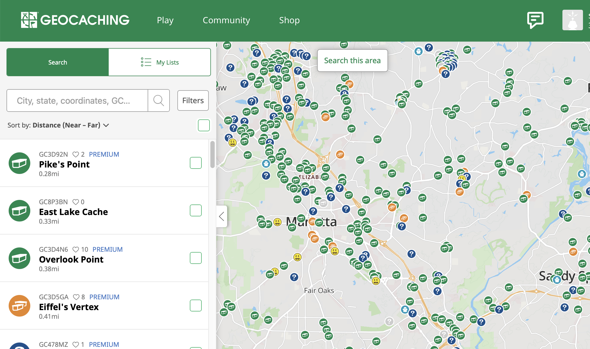
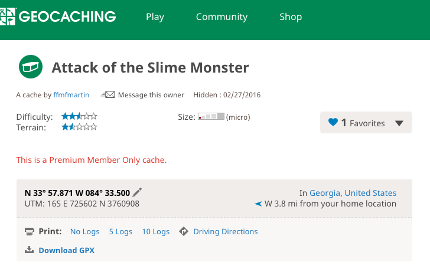
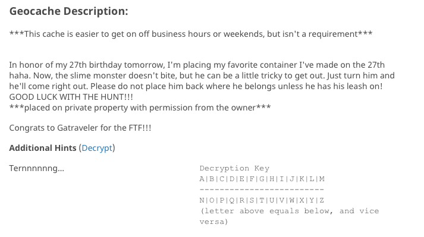
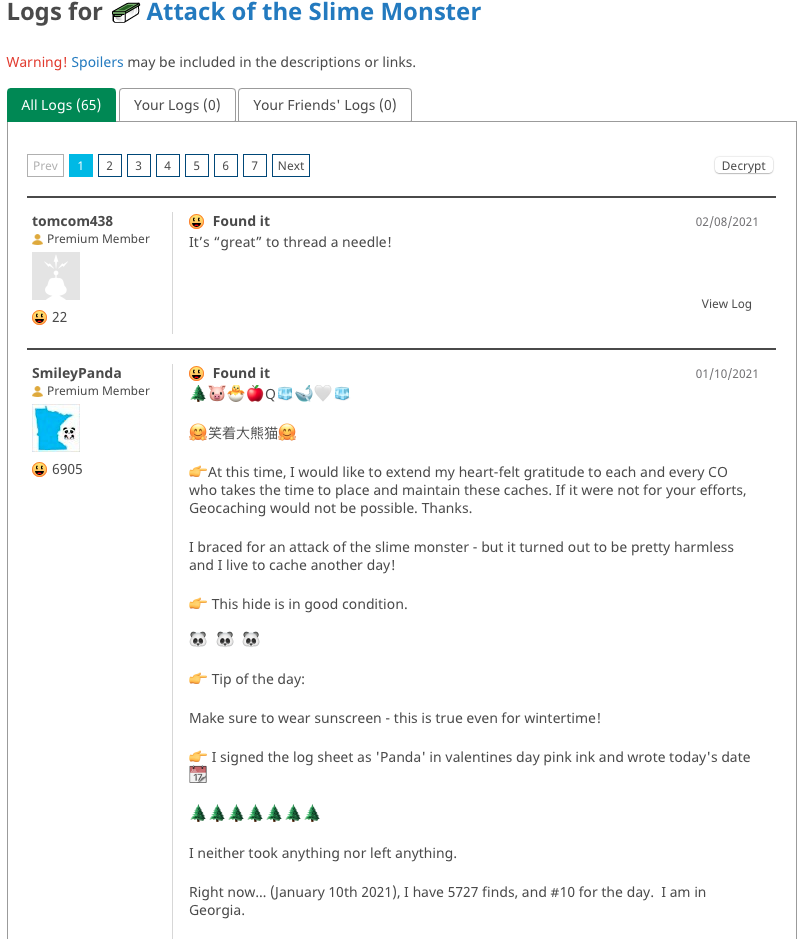
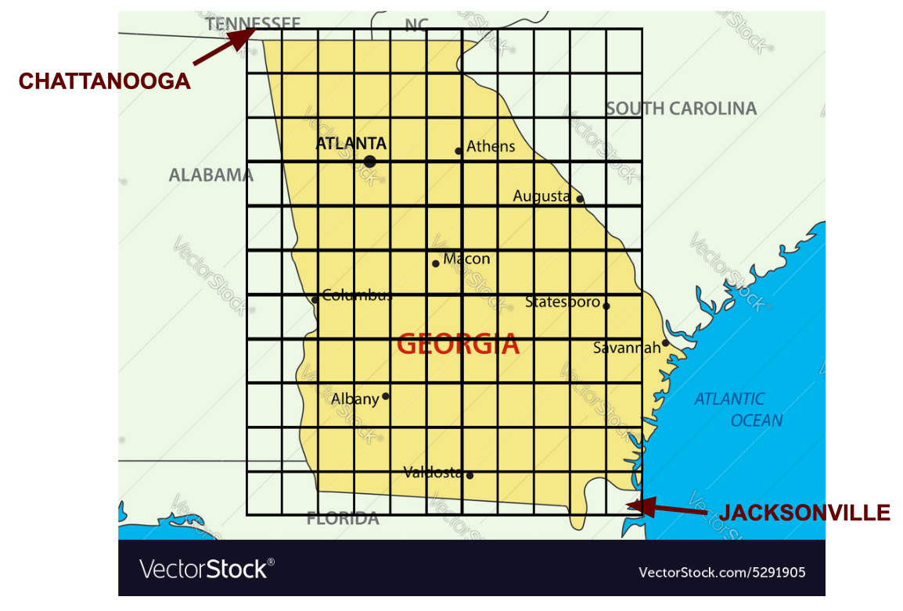
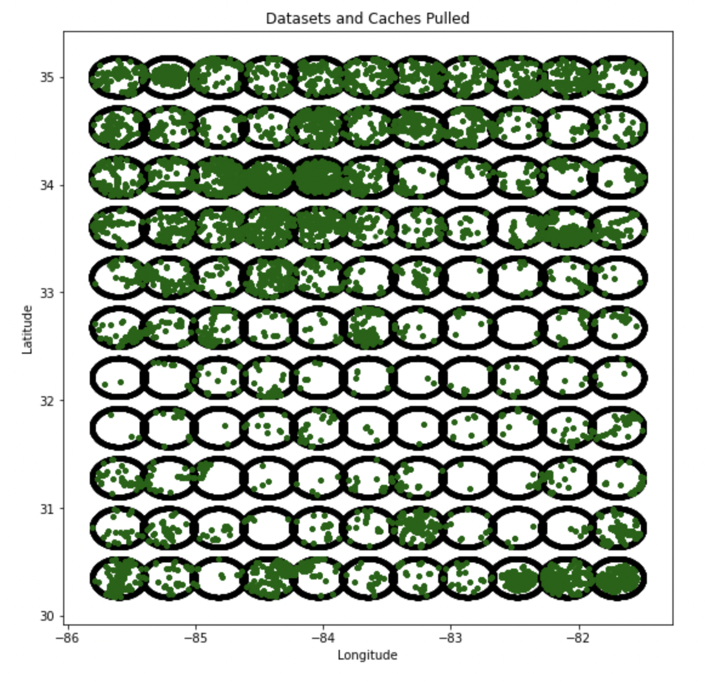
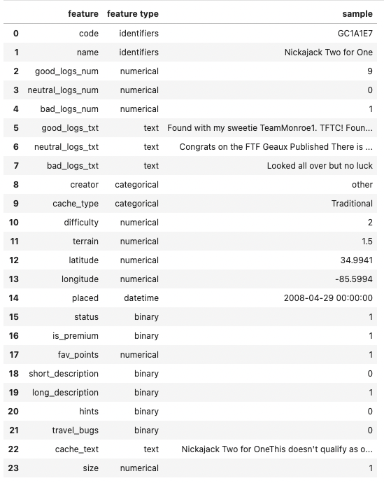

# YourNextGeocache: A recommender app for avid geocachers

## Christina Holland

### Problem Statement: How should you pick your next cache?

My objective is to create a "content-based" recommender system for geocaches. For a geocacher using my app, they will get results something like: "If you liked GC47X42 'That Really Big Tree', then you'll probably enjoy ...."

#### Why is this needed?

This is designed for anyone who enjoys geocaching! My father & step-mom, my husband and myself are all geocachers. There are MILLIONS of caches world-wide. When I log in, I see 228 caches within 3.5 miles of my house. How should I decide where to go? Existing filters on geocaching.com are inadequate, and new caches are showing up all the time. This recommender app aims to solve this problem. If successful (and with full access to ALL the global data, far beyond the current scope of this project), geocaching.com could implement this app into their platform, to improve the experience for everyone within the geocaching community.

| view 0 | view 1 | view 2 |
|---|---|---|
||||
(images are from geocaching.com)

#### Questions Addressed:

The primary question is, what features of a geocache are most important for people's enjoyment? This will be addressed in two phases:

1. Predictive modeling of cache popularity. This is the supervised learning phase, using a variety of classification models. The target variable is "FavPoints", the number of times a cache has been favorited. This variable has been binarized, with "1" being 2 or more favpoints and "0" being 1 or no favpoints. This split leads to very balanced classes.

2. Recommender system for individual cachers to find caches they would like, based on a cache they already know they like. This analysis will use both clustering (KMeans and DBSCAN) and vector cosin similarity / cosine distance.

#### Success Metrics for the Unsupervised Portion:

Success is a bit difficult to define in a recommender system, since they do not have an inherent target variable that is known for some training set.

In this case, I do have a feature "FavPoints" which is related to the number of geocachers who have marked a given cache as a "favorite". So the supervised learning stage of this project, prediciting "FavPoints"is useful because it helps show which features are important to include.

I do of course have some metrics available:
1. For KMeans, I can use silhouette score and inertia to get some measure of how good the clustering is.
2. For DBSCAN, I can use silhouette score, inertia, and also the percentage of caches that get labeled as noise rather than being clustered.
3. For recommending based on cosine similarity, I want to see whether or not I can get some that are clearly a lot more similar (cs close to 1) and others clearly different (cs close to -1), vs. all having cosine similarity close to 0.
4. I would also hope that the pairs/groups of caches with cosine distance closest to 0 would tend to be in the same clusters from KMeans and/or DBSCAN -- using the different methods to validate one another.

### [Click Here for the Executive Summary](ExecSummary.md)

### Table of Contents:

#### Scripts and Notebooks:

| main directory | folder | notebook/script | inputs | outputs |
| --- | --- | --- | --- | --- |
| README.md | | | | |
| EXEC_SUMMARY.md | | | | |
| PresentationSlides.pdf | | | | |
| | 1_Data_Preparation_EDA | | | |
| | | processSQLfiles.ipynb | Gxx_xx.db3 | caches_raw.csv |
| | | checklogs.py | | |
| | | compilelogs.py | caches_raw.csv | compiled_data.csv |
| | | EDA_cleaning.ipynb | compiled_data.csv | <ul><li>cleaned_data.csv</li><li>features.csv</li></ul> |
| | | get_sentiment.ipynb | <ul><li>features.csv</li><li>cleaned_data.csv</li></ul> | sentiments.csv |
| | 2_SupervisedLearning | | | |
| | | prediction.ipynb | <ul><li>features.csv</li><li>cleaned_data.csv</li><li>sentiments.csv</li><li> | <ul><li>X1.csv</li><li>X2.csv</li><li>X3.csv</li></ul> |
| | | languageprocessing.ipynb | X3.csv | <ul><li>text_scores.csv</li><li>bag0words.csv</li></ul> |
| | | predictive_models.ipynb | <ul><li>features.csv</li><li>cleaned_data.csv</li><li>X1.csv</li><li>X2.csv</li><li>X3.csv</li><li>text_scores.csv</li><li>bagOwords.csv</li></ul> | <ul><li>predictive_scores.csv</li><li>rf_predictive_scores.csv</li><li>predictive_feature_import.csv</li><li>modelfornewcaches.sav</li></ul> |
| | | predictive_model_feature_engineering.ipynb | <ul><li>X2.csv</li><li>features.csv</li><li>cleaned_data.csv</li></ul> |  |
| | | neural_net.ipynb | <ul><li>X2.csv</li><li>cleaned_data.csv</li></ul> | |
| | 3_PopularityPredictorAppDevelopment | | | |
| | | newcache.py | modelfornewcaches.sav | |
| | 4_UnsupervisedLearning | | | |
| | | encode_indices.ipynb | <ul><li>features.csv</li><li>cleaned_data.csv</li></ul> | <ul><li>codes.csv</li><li>names.csv</li><li>ctext.csv</li><li>coords.csv</li><li>strippeddata.csv</li></ul> |
| | | Kmeansclustering.ipynb | <ul><li>strippeddata.csv</li><li>names.csv</li><li>codes.csv</li></ul> | <ul><li>data_withKMeans.csv</li><li>code_name_label.csv</li></ul> |
| | | DBSCANclustering.ipynb | <ul><li>strippeddata.csv</li><li>data_withKMeans.csv</li></ul> | data_withDBSCAN.csv |
| | | CleanText.ipynb | ctext.csv | clean_text.csv |
| | | CosineSimilarity.ipynb | <ul><li>stripped_data.csv</li><li>clean_text.csv</li></ul> | <ul><li>recommender1.csv</li><li>recommender2.csv</li><li>recommender_comb.csv</li></ul>|
| | | ExploreRecommendations.ipynb | <ul><li>strippeddata.csv</li><li>code_name_label.csv</li><li>coords.csv</li><li>recommender1.csv</li><li>recommender2.csv</li></ul> | |
| | 5_CacheRecommenderAppDevelopment | | | |
| | | makerecommender.py | <ul><li>strippeddata.csv</li><li>code_name_label.csv</li><li>coords.csv</li><li>recommender1.csv</li></ul> | recommendations_file.csv |
| | | makerecommender_section.py | <ul><li>strippeddata.csv</li><li>code_name_label.csv</li><li>coords.csv</li><li>recommender1.csv</li></ul> | rec_fileX_X.csv |
| | | finalFileCreation.ipynb | recommendations_file.csv | recommendations_file.csv |
| | | recommender.py | <ul><li>code_name_label.csv</li><li>coords.csv</li><li>recommendations_file.csv</li><ul> | |
| | 6_Notes_and_Images | | | |
| | | assets (folder, images) | | |
| | | Bayes_surveyfeedback.ipynb | | |
| | | Notes.md | | |
    
#### Data Files:
    
| data/original_files | data/working_files | data/final_files |
| --- | --- | --- |
| Gxx_xx.db3 | caches_raw.csv | code_name_label.csv |
|            | compiled_data.csv | coords.csv |
|            | cleaned_data.csv | recommendations_file.csv |
|            | features.csv | |
|            | sentiments.csv | |
|            | X1.csv | |
|            | X2.csv | |
|            | X3.csv | |
|            | text_scores.csv | |
|            | bagOwords.csv | |
|            | predictive_scores.csv | |
|            | rf_predictive_scores.csv | |
|            | predictive_feature_import.csv | |
|            | codes.csv | |
|            | names.csv | |
|            | ctext.csv | |
|            | strippeddata.csv | |
|            | data_withKMeans.csv | |
|            | data_withDBSCAN.csv | |
|            | recommender1.csv | |
|            | recommender2.csv | |
|            | recommender_comb.csv | |

### Acquiring Data:

__1. GSAK.net (Geocaching Swiss Army Knife)__

GSAK provides an executable program that can be run on Windows machines only, which accesses the geocaching.com API and allows pulls of up to 500 caches at a time, centered on specified lat/lon coordinates, and returns displays of values. It also saves an SQL file (.db3) to disk. It is necessary to use GSAK because Geocaching.com only gives out API keys to large organizations or companies that provide a benefit to all geocachers (such as GSAK). Through GSAK, I am permitted to pull up to 500 caches at a time, and up to 16,000 per 24 hour day, which is more than I can actually get done in a day.

GSAK allows a download of a csv file, but there is no inherent way to include the geocache log entries; those are displayed in a separate panel. However all of the information is in the .db3 file for each pull, in separate SQL tables.

__2. Choosing the locations__

I have chosen an 11 x 11 point grid, rectangular in the lat/lon coordinate space, that roughly covers the State of Georgia, for the centers of the pulls from GSAK. This means I will get 121 .db3 files, and pull them together into onle large dataframe.

|           | minimum         | step          | maximum         |
|---        |---              |---            |---              |
| latitude  | 30.35N (+30.35) | 0.465 degrees | 35.00N (+35.00) |
| longitude | 85.60W (-85.60) | 0.39  degrees | 81.70W (-81.70) |

| Data Grid Overlay | Cache Locations |
|---|---|
|||

121 .db3 files have been collected on this grid, and named: G00_00.db3 through G10_10.db3, where the first number is the latitude index and the second is the longitude index. Since GSAK only runs on Windows and I work on a Mac, these were ported over manually.

__3. Processing in SQL__

For each file, I need to use SQL to merge 4 tables: caches, cachememo, logs, and logmemo, using the geocache code (GC#) and the log id number.

__4. Merging into a single csv file__

Thanks to the information at https://stackoverflow.com/questions/36028759/how-to-open-and-convert-sqlite-database-to-p and much appreciated help from Varun, the SQL query and merging into a single csv file can be done in a signle python notebook - could be done in a script, but no need, it's very fast.

__5. Cleaning__
    
There are 12433 Caches in this dataset. Number of Logs per cache is between 1 and 70, with a mean of 10.111960106169066. Logs are counted and combined into 'good', 'bad', and 'neutral' according to their log type:

| category | log types |
| ---      | ---       |
| good     | "Found it", "Enable Listing", "Will Attend" |
| neutral  | "Write note", "Owner Maintenance", "Post Reviewer Note", "Announcement", "Attended", "Publish Listing", "Webcam Photo Taken", "Temporarily Disable Listing", "Update Coordinates", "Unarchive", "Archive" |
| bad      | = "Didn't find it", "Needs Maintenance", "Needs Archived" |

NULLS in text fields were filled with empty strings. The text for name + short_description + long_description + hint were combined into one text corpus per cache, and dummy fields created on whether the fields (except name) were populated or not. The 'travel_bug' column was binarized - 1 if cache has ever had a travelbug, 0 if not. The name of the cache creator was replaced with "other" if they hadn't created at least 50 caches. The codes for cache_type were replaced with descriptions of the type(ref: https://gsak.net/help/hs21040.htm, https://www.geocaching.com/about/cache_types.aspx). Container was changed to numeric size, 0 for non-traditionals, and unknown/other were filled with the median for traditional caches, 0 for cache types that would not have a container. I also: changed "placed" to a datetime (time of cache creation), binarized "status": 1 for active, 0 for temporarily disabled, and saved to data/working_files/cleaned_data.csv, saved features types to data/working_files/features.csv.

#### Software requirements:

| Purpose                | Libraries  | Import Statements                                                                 |
| ---                    | ---        | ---                                                                               | 
| Data Aquisition        | sqlite3    | import sqlite3                                                               |
| DataFrame manipulation | pandas     | import pandas as pd                                                               |
|  and cleaning          | numpy      | import numpy as np                                                                |
|                        | datetime   | from datetime import datetime                                                     |
|                        |            | import datetime                                                                   |
|                        | time       | import time                                                                       |
|                        | os         | import os                                                                         |
| Plotting and EDA       | matplotlib | import matplotlib.pyplot as plt                                                   |
|                        | seaborn    | import seaborn as sns                                                             |
| Suervised Learning     | sklearn    | from sklearn.model_selection import train_test_split, cross_val_score, GridSearchCV |
|                        |            | from sklearn.linear_model import LogisticRegression, LogisticRegressionCV |
|                        |            | from sklearn.naive_bayes import MultinomialNB, BernoulliNB |
|                        |            | from sklearn.neighbors import KNeighborsClassifier                             |
|                        |            | from sklearn.ensemble import RandomForestClassifier, BaggingClassifier,  AdaBoostClassifier |
|                        |            | from sklearn.svm import SVC |
|                        |            | from sklearn.tree import DecisionTreeClassifier |
|                        |            | from sklearn.preprocessing import StandardScaler, PolynomialFeatures              |
|                        |            | from sklearn.metrics import confusion_matrix, ConfusionMatrixDisplay, classification_report |
|                        |            | from sklearn.metrics import accuracy_score, f1_score |
|                        |            | from sklearn.pipeline import make_pipeline, Pipeline                              |
|                        |            | from sklearn.feature_extraction.text import CountVectorizer                              |
|                        | tensorflow | from tensorflow.keras.models import Sequential                                    |
|                        |            | from tensorflow.keras.layers import Dense, Dropout                                  |
|                        |            | from tensorflow.keras.regularizers import l2                                  |
|                        |            | from tensorflow.keras.callbacks import EarlyStopping                                  |
|                        |            | import tensorflow as tf                                 |
| Cosine Similarity      | scipy      | from scipy import sparse |
|                        | sklearn    | from sklearn.metrics.pairwise import pairwise_distances, cosine_distances, cosine_similarity | 
| Cluster Analysis       | sklearn    | from sklearn.metrics import silhouette_score |
|                        |            | from sklearn.cluster import DBSCAN, KMeans | 
| Language Processing    | nltk       | import nltk                                                                       |
|                        |            | nltk.sentiment.vader import SentimentIntensityAnalyzer                            |  
|                        | mechanize  | import mechanize                            |  
|                        | bs4        | from bs4 import BeautifulSoup                            |  
|                        | html2text  | from html2text import html2text                            |  
|                        | re         | import re                            |  
| Google CoLab           | drive      | from google.colab import drive                                                    | 
| App Deployment         | pickle     | import pickle |
|                        | streamlit  | import streamlit as st |
    
  

